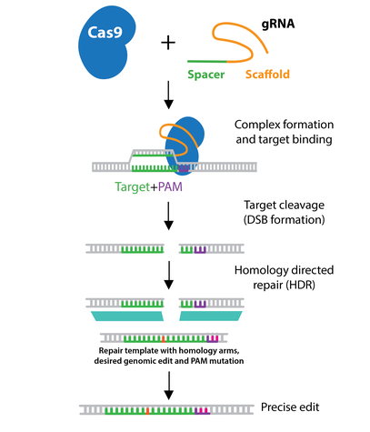

Attached is a file containing guide RNAs of lengths 20bp-23bp, and their location in the human DNA hg38.  
The location is specified in terms of chromosome (e.g. chr7), and starting position (e.g. 14256990).  
The program (written in python or R) must receive the attached file as input,  
and must generate a single fasta file containing amplicons for each guide RNA in the format:  
 
\>unique_id_1  
amplicon_sequence_1  
...
\>unique_id_n  
amplicon_sequence_n

The amplicon for each guide RNA must be extracted from the human genome hg38 automatically,   
with 200bp upstream and 200bp downstream the guide RNA.  
Therefore, the total length of each amplicon sequence will be between 420bp – 423bp, depending on the guide RNA length.  

  

